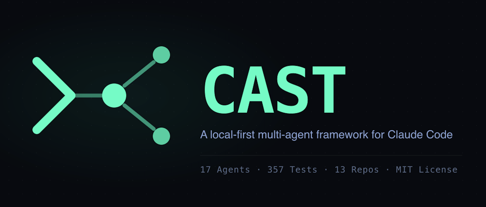

<!-- <p align="center">
  
</p> -->


**[CAST](https://castframework.dev)** — See the full agent team this dashboard was built for.

> **See Also — Native App:** For a native desktop experience with embedded PTY, see [cast-desktop](https://github.com/ek33450505/cast-desktop).

# Claude Code Dashboard

**Observability UI for the CAST Local-First AI Agent OS**

See every agent dispatch, session, hook status, and token cost -- live and historically -- without leaving your browser.

---

Running Claude Code with specialist agents is powerful but opaque. Which agents fired? What did they cost? Are the hooks actually working? Which sessions are burning budget on Sonnet when Haiku would have sufficed?

The dashboard answers all of that. It reads `~/.claude/` directly and streams live session data via SSE -- no accounts, no telemetry, no external services. It is the observability layer for [CAST](https://github.com/ek33450505/claude-agent-team), the model-driven agent dispatch system that runs alongside Claude Code.

The companion desktop app [cast-desktop](https://github.com/ek33450505/cast-desktop) provides a native Tauri interface to the same CAST data, with terminal-first ergonomics.

---

## Prerequisites

- **Node.js 18+**
- **A `~/.claude/` directory** -- present with any Claude Code installation
- **macOS or Linux**
- **CAST** (optional but recommended) -- installs the agents, hooks, and `cast.db` that power the full dashboard experience. Without CAST, session history and analytics views still work; hooks and DB panels degrade gracefully.

---

## Quick Start

### 1. Install the Agent Team (recommended)

```bash
git clone https://github.com/ek33450505/claude-agent-team.git
cd claude-agent-team && bash install.sh
```

Installs 23 specialist agents, slash commands, skills, hook handlers, and rules into `~/.claude/`. Runs alongside [Cast Desktop](https://github.com/ek33450505/cast-desktop) — a native Tauri app offering the same observability with a modern terminal interface.

### 2. Start the Dashboard

```bash
git clone https://github.com/ek33450505/claude-code-dashboard.git
cd claude-code-dashboard
npm install
npm run dev
```

React frontend at [http://localhost:5173](http://localhost:5173). Express API on port 3001.

### 3. Open Claude Code

Hooks are active immediately. Open any Claude Code session -- the model reads `CLAUDE.md` to dispatch agents, and the dashboard streams activity in real time.

---

## Pages

Seventeen pages cover the full observability surface.

| Page | Route | What it shows |
|---|---|---|
| Home | `/` | Live overview: active agents, today's cost, recent runs, system health |
| Sessions | `/sessions`, `/sessions/:project/:sessionId` | Full session history with token counts, cost, model, duration; JSONL detail drill-down; "Compacted" badge on sessions with `context_compacted` events |
| Analytics | `/analytics`, `/analytics/agents/:agent` | 30-day token burn, model tier breakdown, delegation savings, tool frequency, per-agent scorecard with drill-down; Compaction tab |
| Agents | `/agents` | Agent registry, live status, scorecard, run history with filters |
| Agent Reliability | `/agent-reliability` | Hook reliability metrics: hallucinations, completeness events, code ref checks, unstaged warnings (4-tab view) |
| Hooks | `/hooks` | Hook definitions and health status from `settings.json` |
| Memory | `/memory` | Searchable agent and project memory files; filterable by type; inline edit/delete |
| Plans | `/plans` | Implementation plan browser with JSON dispatch manifest detection |
| SQLite Explorer | `/sqlite-explorer` | Paginated read-only browser for `cast.db` tables |
| WorkLog | `/worklog` | Session event timeline and agent run history |
| Swarm | `/swarm` | Active and past CAST Agent Team swarm sessions; teammate roles, task status, token spend per teammate |
| Routines | `/routines` | Scheduled agent dispatch routines from cast.db |
| Incidents | `/incidents` | Episodic incident log from cast.db |
| Injection Log | `/injection-log` | Memory injection event log from cast.db |
| Hook Failures | `/hook-failures` | Hook execution failures and error logs |
| Docs | `/docs` | Documentation and help portal |
| System | `/system` | Tabbed control panel: Agents, Rules, Skills, Memory, Plans, DB, Cron |

Global search is available via `Cmd+K` -- searches sessions, agents, plans, and memories with keyboard navigation.

> **Demo:** Screenshot gallery and demo GIF coming soon.

### Swarm Page

The Swarm page (`/swarm`) visualizes CAST Agent Teams — parallel agent groups working on coordinated tasks.

| Component | What it shows |
|---|---|
| SwarmCard | Team name, status, teammate count, elapsed time, total token spend (aggregated across all teammates) |
| TeammateRow | Per-role breakdown: agent definition, current task, status, individual token spend |
| MessageFeed | Timestamped log of all teammate messages: task assignments, status updates, completion events |
| TokenChart | Horizontal bar chart showing tokens_in + tokens_out per teammate role (Recharts visualization) |

All data is read from `swarm_sessions`, `teammate_runs`, and `teammate_messages` tables in `cast.db`. Polls every 5 seconds via TanStack Query for live updates.

### Agents Page

The Agents page (`/agents`) consolidates agent registry and run history into a single view.

**Agent Registry (card grid):**
- All agents displayed as sortable cards with name, model tier, description
- Active agents highlighted with emerald border
- Search by agent name or description
- Click agent card to drill into recent runs

**Active Agents Strip:**
- Compact horizontal list of currently running agents
- Shows model tier badge and elapsed time
- Real-time updates via SSE

**Scorecard (sortable table):**
- Total runs, success rate, average cost, last run timestamp
- Sort by any column (agent name, runs, success rate, cost, last run)
- Click to filter recent runs by agent

**Recent Runs (with filters):**
- Last 50 agent runs with timestamps, status, duration, token spend
- Filter by agent and status (DONE, DONE_WITH_CONCERNS, BLOCKED, NEEDS_CONTEXT)
- Hover for full task description

### System Tabs

The System page consolidates all configuration and tooling views into a single tabbed interface:

| Tab | What it shows |
|---|---|
| Agents | Full agent registry: model tiers, tool count, memory files; inline editing and new agent form |
| Rules | Rule file browser with previews |
| Skills | Skill definitions with metadata |
| Hooks | Hook status: existence, executable bit, last-fired timestamp; definitions from settings files |
| Memory | Searchable agent and project memory files; filterable by type; inline edit/delete; backup status widget |
| Plans | Plan browser with JSON dispatch manifest detection and run button |
| DB | Read-only paginated browser for `cast.db` tables: sessions, agent_runs, routing_events, agent_memories, quality_gates, compaction_events, agent_truncations, hook_failures, incidents, routines, file_writes, and more |
| Cron | CAST-related crontab entries with CRUD |

---

## Architecture

```
                                                     ┌──────────────────┐
┌──────────────────┐     SSE (real-time)             │                  │
│                  │◀────────────────────────────────│   Express 5 API  │
│   React 19 SPA   │     REST (on demand)            │   Port 3001      │
│   Vite 6 + HMR   │◀────────────────────────────────│                  │
│   Port 5173      │     PUT/POST (editing)          │   chokidar watch │
│                  │────────────────────────────────▶│   JSONL parsing  │
│   TanStack Query │                                 │   gray-matter    │
│   React Router   │                                 │   better-sqlite3 │
│   Tailwind v4    │                                 └────────┬─────────┘
└──────────────────┘                                          │ reads/writes
                                                              ▼
                                                     ┌──────────────────┐
                                                     │   ~/.claude/     │
                                                     │                  │
                                                     │   projects/      │ ← session JSONL logs
                                                     │   agents/        │ ← agent definitions (r/w)
                                                     │   agent-memory-  │
                                                     │     local/       │ ← agent memories (r/w, flat-file)
                                                     │   commands/      │ ← slash commands
                                                     │   skills/        │ ← skill definitions
                                                     │   rules/         │ ← rule files
                                                     │   plans/         │ ← implementation plans
                                                     │   settings.json  │ ← configuration + hooks
                                                     │   settings.local │
                                                     │     .json        │ ← local overrides + hooks
                                                     │   cast.db        │ ← structured run history
                                                     └──────────────────┘
```

The Express server owns all `~/.claude/` I/O. The React SPA never touches the filesystem directly -- it fetches from the API and subscribes to the SSE stream. TanStack Query handles caching, stale-while-revalidate, and background refetch. Each route is wrapped in an `ErrorBoundary` so a broken view never crashes the rest of the app.

`castDbWatcher` polls `cast.db` every 3 seconds and pushes `db_change_agent_run`, `db_change_session`, and `db_change_routing_event` events over the `/api/events` SSE stream when new rows arrive. The React SPA subscribes to this stream and uses incoming events to invalidate TanStack Query caches immediately -- no polling intervals, no manual refresh.

On server startup, a fire-and-forget POST to `/api/cast/seed` backfills token data from existing JSONL files into `cast.db` without blocking the process.

---

## How It Connects to CAST

The dashboard is a read layer over what CAST writes. No CAST-specific code is required in the dashboard -- it just reads the files and database tables.

| File / Resource | Written by | Read by |
|---|---|---|
| `~/.claude/cast.db` (core tables) | CAST hooks (cost-tracker, agent-stop) | Dashboard, Sessions, Analytics, System (DB tab) |
| `~/.claude/cast.db` (`agent_memories` table) | CAST memory-router hook | System (Memory tab) |
| `~/.claude/cast.db` (`swarm_sessions`, `teammate_runs`, `teammate_messages` tables) | CAST Agent Teams hooks | Swarm page, System (DB tab) |
| `~/.claude/cast.db` (`agent_runs` table) | CAST agent-stop hook | Agents page, Analytics |
| `~/.claude/agent-memory-local/*/` | CAST agents (markdown files) | System (Memory tab) |
| `~/.claude/projects/*/` | Claude Code session runner | Sessions, Dashboard |
| `~/.claude/agents/`, `plans/`, etc. | CAST install + user | System (Agents, Plans tabs) |
| `~/.claude/settings.json` | Claude Code + CAST | System (Hooks tab) |

Install CAST first for the full picture. The dashboard degrades gracefully if CAST is absent -- session history and analytics still work from raw JSONL. To see swarm and agent run data, CAST v4.6+ with Agent Teams integration is required.

---

## CAST v4.6 Architecture

CAST uses **model-driven dispatch** -- `CLAUDE.md` contains a dispatch table that the model reads to decide which agent to call. No routing scripts, no regex patterns.

| Concept | Details |
|---|---|
| **Agents** | 23 specialists across 2 model tiers (Sonnet, Haiku) + Opus |
| **Model tiers** | Sonnet for complex analysis, Haiku for lightweight/review tasks, Opus for long-context synthesis |
| **Hooks** | Quality gates: PostToolUse:Agent (code-reviewer auto-dispatch), PreToolUse:Bash (guard), cost-tracker, agent-stop (observability) |
| **Agent Teams** | `/swarm` skill spawns parallel agents with quality gates and isolated worktrees; hooks track teammate lifecycle |
| **Observability** | `cast.db` SQLite: agent_runs, sessions, routing_events, agent_memories, quality_gates, compaction_events, agent_truncations, hook_failures, incidents, routines, file_writes, and more |
| **Scheduling** | Cron-based |
| **Post-chain** | After code changes: code-reviewer -> commit -> push |

---

## Environment / Config

No `.env` file is required for local development. The server reads `~/.claude/` using the `HOME` environment variable.

| Variable | Default | Purpose |
|---|---|---|
| `CORS_ORIGIN` | `http://localhost:5173` | Allowed origin for the Express CORS header |

To change the API port, update `PORT` in `server/constants.ts` and the Vite proxy config in `vite.config.ts`.

---

## API Reference

### Sessions

| Endpoint | Method | Description |
|---|---|---|
| `/api/sessions` | GET | Session list with summary stats (supports `?project=` and `?limit=`) |
| `/api/sessions/:project/:id` | GET | Full JSONL entries for a session |
| `/api/sessions/:project/:id/export` | GET | Session as markdown export |
| `/api/sessions/:project/:id` | DELETE | Delete a session |

### Agents

| Endpoint | Method | Description |
|---|---|---|
| `/api/agents` | GET | All installed agents with parsed frontmatter |
| `/api/agents/:name` | GET | Single agent with full markdown body |
| `/api/agents/:name` | PUT | Update agent frontmatter fields |
| `/api/agents` | POST | Create a new agent definition |
| `/api/agents/live` | GET | Currently running subagents |

### CAST / cast.db

| Endpoint | Method | Description |
|---|---|---|
| `/api/cast/token-spend` | GET | 30-day token/cost data from `cast.db` |
| `/api/cast/agent-runs` | GET | Agent run history from `cast.db` |
| `/api/cast/task-queue` | GET | Current task queue from `cast.db` |
| `/api/cast/memories` | GET | Agent memories from `cast.db` |
| `/api/cast/explore/tables` | GET | List allowed tables in `cast.db` |
| `/api/cast/explore/:table` | GET | Paginated read of a `cast.db` table |
| `/api/cast/seed` | POST | Backfill token data from JSONL into `cast.db` |
| `/api/cast/plans` | GET | Plans with manifest detection |
| `/api/completeness-events` | GET | Completeness events from cast.db (paginated) |
| `/api/code-ref-checks` | GET | Code reference check results from cast.db (paginated) |
| `/api/cast/cost-summary` | GET | Aggregated cost breakdown by model and top sessions |

### Swarm

| Endpoint | Method | Description |
|---|---|---|
| `/api/swarm/sessions` | GET | List of all swarm sessions (active and past), ordered by started_at DESC |
| `/api/swarm/sessions/:id` | GET | Single swarm session with all teammate_runs for that swarm_id |
| `/api/swarm/sessions/:id/messages` | GET | All teammate_messages for a swarm_id, ordered by timestamp DESC |


### Analytics

| Endpoint | Method | Description |
|---|---|---|
| `/api/analytics` | GET | Cross-session token/cost aggregates |
| `/api/analytics/profile` | GET | Per-agent scorecard from `cast.db` |
| `/api/analytics/profile/:agent` | GET | Single-agent drill-down |

### Hooks and Routing

| Endpoint | Method | Description |
|---|---|---|
| `/api/hooks/health` | GET | Hook health: existence, executable bit, last fired |
| `/api/hooks` | GET | Hook definitions from settings files |
| `/api/hook-events` | POST | HTTP hook receiver -- accepts Claude Code hook payloads and broadcasts as `hook_event` SSE events |
| `/api/routing/events` | GET | Dispatch event log from `cast.db`; supports `?event_type=<type>` filter |
| `/api/routing/event-types` | GET | Distinct event types present in `cast.db` |
| `/api/routing/stats` | GET | Aggregate dispatch statistics |

### Control

| Endpoint | Method | Description |
|---|---|---|
| `/api/control/dispatch` | POST | Spawn a CAST agent directly via `child_process.spawn`; tracked in `cast.db task_queue` |
| `/api/control/queue` | GET | Current task queue sorted by `queuedAt` |
| `/api/control/weekly-report` | POST | Run `cast-weekly-report.sh` and return output |

### Config and Knowledge

| Endpoint | Method | Description |
|---|---|---|
| `/api/config/health` | GET | System health overview |
| `/api/memory` | GET | Project and agent memory files with `lastModified` timestamps |
| `/api/memory/backup-status` | GET | Last backup timestamp and log size |
| `/api/memory/backup-trigger` | POST | Run `cast-memory-backup.sh --dry-run` |
| `/api/plans` | GET | Implementation plan files |
| `/api/rules` | GET | Rule files with previews |
| `/api/skills` | GET | Skill definitions with metadata |
| `/api/commands` | GET | Slash commands |
| `/api/castd/status` | GET | Cron job status: CAST-related crontab entries |
| `/api/outputs/:category` | GET | Briefings, meetings, reports, or email-summaries |
| `/api/search?q=` | GET | Global search across sessions, agents, plans, memories |
| `/api/budget` | GET | Budget status from `cast.db` |

### Real-time

| Endpoint | Method | Description |
|---|---|---|
| `/api/events` | SSE | Real-time session and agent activity stream (exponential backoff reconnect); includes `db_change_agent_run`, `db_change_session`, and `db_change_routing_event` push events from `castDbWatcher` |

---

## Stack

| Layer | Technology |
|---|---|
| Frontend | React 19, TypeScript, Tailwind CSS v4, Framer Motion |
| UI Components | shadcn/ui, Lucide React, cmdk (Cmd+K palette), sonner (toasts) |
| Charts | Recharts, @nivo |
| Routing | React Router v6, React.lazy code splitting, per-route ErrorBoundary |
| State | TanStack Query v5, TanStack Virtual (virtualized lists) |
| Backend | Express 5, chokidar (file watching), tsx |
| Database | better-sqlite3 (`cast.db` -- sessions, agent runs, task queue, swarm sessions, teammate runs/messages) |
| Parsing | gray-matter (YAML frontmatter), JSONL line reader |
| Testing | Vitest, React Testing Library |

---

## Development

```bash
npm run dev          # Start Express + Vite concurrently (API on :3001, UI on :5173)
npm run build        # Production build (tsc + vite)
npm run preview      # Serve the production build locally
npm test             # Run Vitest suite
```

---

## Local-First Design

Everything runs on your machine. No cloud, no telemetry, no external services.

- **Filesystem native** -- reads `~/.claude/` directly; agent definitions, memories, and configs are plain markdown and JSON
- **SQLite-backed** -- `cast.db` stores sessions, agent runs, task queue, memories, and budgets for structured queries
- **Human-editable** -- every config file is readable and editable outside the dashboard; nothing is locked in a database
- **No telemetry** -- no usage data sent anywhere; the server never phones home
- **No account required** -- no login, no API keys beyond what Claude Code already uses
- **Portable** -- `~/.claude/` is the source of truth; move it, back it up, version-control it

---

## About CAST

CAST (Claude Agent Specialist Team) is the companion framework this dashboard observes. It installs 23 specialist agents, hook scripts, slash commands, and quality gates into `~/.claude/`. Hooks fire on Claude Code interactions -- enforcing code review after edits, tracking dispatch costs, and logging session completions.

**v4.6 adds Agent Teams:** The `/swarm` skill lets you bootstrap parallel agent groups (frontend-dev + backend-dev + reviewer, for example) with isolated git worktrees and seeded identity/quality gate rules. The dashboard's new **Swarm page** shows team membership, task status, and token spend per teammate. The **Agents page** provides a comprehensive agent registry with live status, per-agent scorecard, and run history filters.

The dashboard reads what CAST writes: `cast.db` (agent runs, swarm sessions, teammate activity), agent definition files, and hook configurations. Install CAST v4.6+ for the full feature set; older versions still work for Sessions and Analytics.

[CAST on GitHub](https://github.com/ek33450505/claude-agent-team)

[CAST Framework (docs)](https://castframework.dev)

---

## Contributing

See [CONTRIBUTING.md](CONTRIBUTING.md) for guidelines.

---

Built by [Ed Kubiak](https://github.com/ek33450505). Part of the [CAST](https://github.com/ek33450505/claude-agent-team) system.

---

## CAST Ecosystem

> Auto-synced from [claude-agent-team/docs/ecosystem.md](https://github.com/ek33450505/claude-agent-team/blob/main/docs/ecosystem.md). Run `~/Projects/personal/claude-agent-team/scripts/sync-ecosystem-readme.sh` to refresh.

<!-- ECOSYSTEM_START -->
| Repo | Description | Latest | Install |
|---|---|---|---|
| [cast-hooks](https://github.com/ek33450505/cast-hooks) | 13 auditable hook scripts — observability, safety guards, quality gates. SessionStart, PreToolUse, PostToolUse, PostCompact. |  | `brew tap ek33450505/cast-hooks && brew install cast-hooks` |
| [cast-agents](https://github.com/ek33450505/cast-agents) | 23 specialist agents — commit, debug, review, plan, test, research, and more. Agent definitions with YAML frontmatter. v7-synced. |  | `brew tap ek33450505/cast-agents && brew install cast-agents` |
| [cast-memory](https://github.com/ek33450505/cast-memory) | Persistent agent memory with FTS5 search, relevance scoring, shared pool, semantic embeddings. Per-agent knowledge accumulation. |  | `brew tap ek33450505/cast-memory && brew install cast-memory` |
| [cast-routines](https://github.com/ek33450505/cast-routines) | Scheduled autonomous Claude Code routines via YAML + cron. Daily briefings, inbox triage, release celebration, weekly cost reports. |  | `brew tap ek33450505/cast-routines && brew install cast-routines` |
| [cast-parallel](https://github.com/ek33450505/cast-parallel) | Parallel agent execution across worktree sessions. Agent Dispatch Manifest (ADM) support. |  | `brew tap ek33450505/cast-parallel && brew install cast-parallel` |
| [cast-observe](https://github.com/ek33450505/cast-observe) | Session-level observability — cost tracking, agent run history, token spend, event sourcing. Feeds cast.db. |  | `brew tap ek33450505/cast-observe && brew install cast-observe` |
| [cast-security](https://github.com/ek33450505/cast-security) | Security hooks and audit trails. PII redaction, parry-guard integration, compliance logging. |  | `brew tap ek33450505/cast-security && brew install cast-security` |
| [cast-doctor](https://github.com/ek33450505/cast-doctor) | Read-only health check for any Claude Code install. Validates hooks, MCP servers, agent frontmatter, cast.db schema, stale memories. |  | `brew tap ek33450505/cast-doctor && brew install cast-doctor` |
| [cast-time](https://github.com/ek33450505/cast-time) | Gives Claude Code a clock — injects local time, timezone, and a semantic time-of-day bucket at every SessionStart. |  | `brew tap ek33450505/cast-time && brew install cast-time` |
| [cast-dash](https://github.com/ek33450505/cast-dash) | Terminal UI dashboard for live swarm monitoring. 4-panel real-time display (Textual framework). |  | `brew tap ek33450505/cast-dash && brew install cast-dash` |
| [cast-claudes_journal](https://github.com/ek33450505/cast-claudes_journal) | Session continuity — Claude's Journal auto-injects prior-day context via SessionStart hook. Obsidian vault sync. |  | `brew tap ek33450505/homebrew-claudes-journal && brew install claudes-journal` |
| [cast-website](https://github.com/ek33450505/cast-website) | castframework.dev — marketing site and docs portal for the CAST ecosystem. |  | — |
| [cast-desktop](https://github.com/ek33450505/cast-desktop) | Tauri 2 native app — embedded PTY terminal, command palette, 11 dashboard views, Constellation 3D graph. NEW. |  | `brew tap ek33450505/homebrew-cast-desktop && brew install cast-desktop` |
<!-- ECOSYSTEM_END -->
