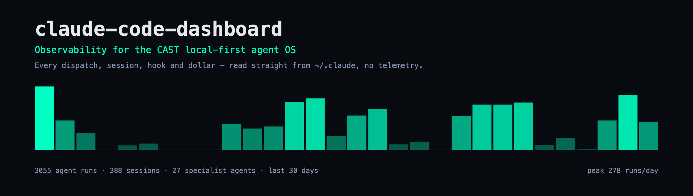

# Claude Code Dashboard

<p align="center">
  
</p>


**See exactly what your AI agents are doing — every session, every dollar spent, every hook that fires — live, entirely on your own machine.**

Claude Code Dashboard is the observability layer for CAST, a local-first AI agent operating system: 18 pages of session history, cost analytics, agent reliability, and hook health, reading straight from `~/.claude/` with zero cloud dependency and zero telemetry.

The banner above isn't decoration — it's regenerated live from real `cast.db` data via `scripts/make-banner.py`. Run `python3 scripts/make-banner.py --png` to refresh it after seeding new data. (`--png` needs macOS `qlmanage`/`sips`; without it, only `docs/banner.svg` is written.)

---

## See it work

Clone and run.

```bash
git clone https://github.com/ek33450505/claude-code-dashboard.git
cd claude-code-dashboard
npm install
npm run dev
```

React frontend at [http://localhost:5173](http://localhost:5173). Express API on port 3001. Open Claude Code — hooks are active immediately, and the dashboard streams agent activity in real time.

---

## What makes it different

**Reads `~/.claude/` directly.** No cloud, no accounts, no telemetry. The dashboard reads session JSONL logs, agent definitions, and `cast.db` from your machine. Nothing leaves.

**Loopback-only by default.** Every GET endpoint is unauthenticated by design — all sessions and costs are visible to localhost only. Binding to a non-loopback address requires explicit `DASHBOARD_HOST` config and is logged as a security warning at startup.

**Read-only by default, fail-closed writes.** All 12 mutating endpoints return 404 when `CAST_DASHBOARD_CONTROL=1` is not set. When enabled, they require a `DASHBOARD_TOKEN` header (fail-closed without it: 503 unconfigured, 403 bad token).

**Record integrity matters.** The server performs zero database writes on startup — `cast.db` schema is owned exclusively by CAST. A schema-drift guard (`server/utils/schemaGuard.ts`) validates all referenced tables and columns at startup; a contract test asserts presence.

---

## Pages

The dashboard covers the full observability surface across 18 pages:

| Page | Route | What it shows |
|---|---|---|
| Home | `/` | Live overview: active agents, today's cost, recent runs, system health |
| Sessions | `/sessions`, `/sessions/:project/:id` | Session history with token counts, cost, model, duration; JSONL detail drill-down |
| Analytics | `/analytics`, `/analytics/agents/:agent` | 30-day token burn, model tier breakdown, delegation savings, tool frequency, per-agent scorecard |
| Agents | `/agents` | Agent registry, live status, scorecard, run history with filters |
| Executive | `/executive` | Executive summary: KPIs for plans, pass-rate, hook failures, cost |
| Evals | `/evals` | CAST eval-harness results: pass@k per eval, by agent/model |
| Outputs | `/outputs` | Agent-generated briefings, meetings, and reports |
| Agent Reliability | `/agent-reliability` | Hook reliability across 7 tabs: hallucinations, completeness, code-ref checks, unstaged warnings, truncations, protocol violations, worktree anomalies |
| Hooks | `/hooks` | Hook definitions and health status from `settings.json` |
| Memory | `/memory` | Searchable agent and project memory files; inline edit/delete; consolidation status |
| Plans | `/plans` | Implementation plan browser with JSON dispatch manifest detection |
| DB | `/db` | Paginated read-only browser for `cast.db` tables: sessions, agent_runs, routing_events, agent_memories, quality_gates, and 30+ more |
| Work Log | `/work-log` | Session event timeline and agent run history |
| Routines | `/routines` | Scheduled agent dispatch routines from cast.db |
| Incidents | `/incidents` | Episodic incident log from cast.db |
| Injection Log | `/injection-log` | Memory injection event log from cast.db |
| Hook Failures | `/hook-failures` | Hook execution failures and error logs |
| Docs | `/docs` | Documentation and help portal |

Global search is available via `Cmd+K` — searches sessions, agents, plans, and memories with keyboard navigation.

---

## Prerequisites

- **Node.js 20+**
- **macOS or Linux**
- **A `~/.claude/` directory** — present with any Claude Code installation
- **CAST** (optional but recommended) — installs 27 specialist agents, hooks, and seeds `cast.db`. Without CAST, session history and analytics still work from raw JSONL; DB and agent-run pages degrade gracefully.

---

## How it connects to CAST

The dashboard is a read layer over what CAST writes. No CAST-specific code in the dashboard — it reads files and database tables.

| File / Resource | Written by | Read by |
|---|---|---|
| `~/.claude/cast.db` (core tables) | CAST hooks (cost-tracker, agent-stop) | Dashboard analytics, sessions, DB tab |
| `~/.claude/cast.db` (`agent_runs` table) | CAST agent-stop hook | Agents page, analytics |
| `~/.claude/cast.db` (`agent_memories` table) | CAST memory-router hook | Memory tab |
| `~/.claude/projects/*/` | Claude Code session runner | Sessions, home page |
| `~/.claude/agents/` | CAST install + user | System (Agents tab) |
| `~/.claude/settings.json` | Claude Code + CAST | Hooks tab |

Install CAST v9+ for the full feature set. The dashboard degrades gracefully if CAST is absent.

---

## Architecture

```
┌──────────────────┐     SSE (real-time)      ┌──────────────────┐
│                  │◀─────────────────────────│                  │
│   React 19 SPA   │     REST (on demand)     │   Express 5 API  │
│   Vite 6 + HMR   │◀─────────────────────────│   Port 3001      │
│   Port 5173      │     PUT/POST (editing)   │                  │
│                  │────────────────────────▶│   chokidar watch │
│   TanStack Query │                         │   gray-matter    │
│   React Router   │                         │   better-sqlite3 │
│   Tailwind v4    │                         └────────┬─────────┘
└──────────────────┘                                  │ reads/writes
                                                      ▼
                                             ┌──────────────────┐
                                             │   ~/.claude/     │
                                             │   cast.db        │
                                             │   projects/      │
                                             │   agents/        │
                                             │   agent-memory-  │
                                             │     local/       │
                                             │   settings.json  │
                                             └──────────────────┘
```

The Express server owns all `~/.claude/` I/O. The React SPA fetches from the API and subscribes to the SSE stream (`/api/events`). TanStack Query handles caching and background refetch. `castDbWatcher` polls `cast.db` every 3 seconds and pushes events when new rows arrive — React invalidates caches immediately, no polling.

---

## API Reference

The dashboard exposes **103 endpoints** — all read-only by default. Full documentation:

**[See docs/API.md](docs/API.md)** for the complete endpoint reference.

**Quick reference — most-used endpoints:**

| Endpoint | Method | What it does |
|---|---|---|
| `/api/sessions` | GET | Session list with summary stats |
| `/api/cast/agent-runs` | GET | Agent run history from `cast.db` |
| `/api/analytics` | GET | Cross-session token/cost aggregates |
| `/api/events` | SSE | Real-time session and agent activity stream |

**Mutating endpoints** (all fail-closed, require `CAST_DASHBOARD_CONTROL=1` + `DASHBOARD_TOKEN`):
- `/api/control/dispatch` — spawn agents
- `/api/cast/seed` — backfill token/cost data from JSONL
- `/api/cast/memories/:id` — delete memory
- 8 more listed in `docs/API.md`

---

## Environment / Config

No `.env` file required for local development. The server reads `~/.claude/` using the `HOME` environment variable.

| Variable | Default | Purpose |
|---|---|---|
| `PORT` | `3001` | Express API port. Override as env var; also update Vite proxy in `vite.config.ts`. |
| `DASHBOARD_HOST` | `127.0.0.1` | Bind interface. Non-loopback values (e.g., `0.0.0.0`) expose all sessions and `cast.db` to your network — a startup warning is logged. |
| `CORS_ORIGIN` | `http://localhost:5173` | Allowed CORS origin. |
| `CAST_DASHBOARD_CONTROL` | unset | Set to `1` to enable write/control endpoints. Default: read-only (mutating endpoints return 404). |
| `DASHBOARD_TOKEN` | unset | Required header token when control is enabled. Fail-closed: 503 if unconfigured, 403 if bad/missing. |
| `CAST_BIN` | `~/.claude/../claude-agent-team/bin/cast` | Path to the CAST `cast` CLI binary. Used by `/api/control/dispatch`. |
| `CAST_REPO_DIR` | `~/Projects/personal/claude-agent-team` | CAST repository directory. Used for `git worktree list` queries and agent dispatch. |
| `CAST_REPO_PATH` | `~/Projects/personal/claude-agent-team` | CAST repository path for commit reverts in control endpoints. |
| `CLAUDE_PATH` | `claude` | Path or command to invoke Claude Code. Used by `/api/control/dispatch`. |

---

## Security

**Read-only out of the box.** All mutating endpoints return 404 when `CAST_DASHBOARD_CONTROL` is disabled. Enabled-but-unconfigured returns 503; bad/missing `DASHBOARD_TOKEN` header returns 403 (constant-time comparison).

**Helmet.** All responses include security headers via Express helmet middleware.

**No startup writes.** The server performs zero database writes, alters, or creates on startup. `cast.db` is owned exclusively by CAST.

---

## Limitations

**Single-user localhost tool.** This is a personal observability dashboard, not a multi-tenant application. Every GET endpoint is unauthenticated by design.

**macOS/Linux only.** Tested on macOS and Linux. Windows support is untested.

**Requires CAST v9+ with `cast.db`.** The dashboard fails closed (503) if `~/.claude/cast.db` is missing or uninitialized. Run `cast status` to initialize it.

**Cost tracking is a lower bound.** `SUM(cost_usd)` from `agent_runs` is incomplete — some rows have NULL cost. Analytics pages expose `runs_missing_cost` alongside cost figures to flag this.

**No automatic cost backfill.** Server startup performs zero DB writes, so nothing is seeded on boot. Token and cost gaps persist until you run `npm run seed` yourself, or call the gated `POST /api/cast/seed`. Budget-status endpoints report incomplete data until then.

---

## Development

```bash
npm run dev            # Start Express + Vite concurrently
npm run build          # Production: vite build, then tsc -p tsconfig.server.json
npm run preview        # Serve production build locally
npm test               # Vitest run
npm run seed           # Backfill cost/token data from JSONL
```

---

## Stack

| Layer | Technology |
|---|---|
| Frontend | React 19, TypeScript, Tailwind CSS v4, Framer Motion |
| UI | shadcn/ui, Lucide, cmdk, sonner |
| Routing | React Router v6, code splitting, per-route ErrorBoundary |
| State | TanStack Query v5, TanStack Virtual |
| Backend | Express 5, chokidar, tsx |
| Database | better-sqlite3 (read-only except admin paths) |
| Parsing | gray-matter, JSONL line reader |
| Testing | Vitest, React Testing Library |

---

## Design & Accessibility

**Theming:** Dark/Light theme toggle in the top navigation bar. Theme preference persists to `localStorage` (`cast-theme` key) and defaults to system preference (`prefers-color-scheme`). Both themes meet WCAG AA contrast requirements. No flash-of-unstyled-content (FOUC) — theme loads synchronously on app bootstrap.

**Accessibility:** Built to **WCAG 2.1 AA** practices (enforced by convention and tests, not a formal audit):
- Keyboard navigation — all interactive controls are keyboard-accessible; roving-tabindex nav on tablists, Escape closes dialogs, focus-trap in modals
- Icon-only buttons have `aria-label`; decorative icons get `aria-hidden`
- Focus visibility — consistent `:focus-visible` rings on all interactive elements; visible on both dark and light themes
- Motion — entrance animations respect `prefers-reduced-motion` via Framer Motion config
- Contrast — all text and meaningful icons meet 4.5:1 contrast in both themes

---

## Contributing

See [CONTRIBUTING.md](CONTRIBUTING.md).

---

Built by [Ed Kubiak](https://github.com/ek33450505). Part of the [CAST](https://github.com/ek33450505/claude-agent-team) system.

---

## CAST Ecosystem

> Auto-synced from [claude-agent-team/docs/ecosystem.md](https://github.com/ek33450505/claude-agent-team/blob/main/docs/ecosystem.md). Run `~/Projects/personal/claude-agent-team/scripts/sync-ecosystem-readme.sh` to refresh.

<!-- ECOSYSTEM_START -->
**Core Framework**

| Repo | Description | Latest | Install |
|---|---|---|---|
| [claude-agent-team](https://github.com/ek33450505/claude-agent-team) | Local-first multi-agent control plane — specialist agents, quality gates, hook enforcement, and the tamper-evident cast.db execution record. |  | `brew tap ek33450505/cast && brew install cast` |

**Observability**

| Repo | Description | Latest | Install |
|---|---|---|---|
| [claude-code-dashboard](https://github.com/ek33450505/claude-code-dashboard) | React observability UI — sessions, agent analytics, hook health, memory browser, SQLite explorer. |  | Clone from GitHub |
| [cast-desktop](https://github.com/ek33450505/cast-desktop) | Tauri 2 native app — embedded PTY terminal, command palette, 11 dashboard views. |  | `brew tap ek33450505/homebrew-cast-desktop && brew install cast-desktop` |

**Standalone Packages**

| Repo | Description | Latest | Install |
|---|---|---|---|
| [cast-mcp](https://github.com/ek33450505/cast-mcp) | Read-only MCP server over the Claude Code execution record (cast.db) — dispatch decisions, incidents, cost, sessions, and full-text search as 5 MCP tools + 5 resources. stdlib-only, strictly read-only. |  | `brew tap ek33450505/cast-mcp && brew install cast-mcp` |
| [cast-ledger](https://github.com/ek33450505/cast-ledger) | Signed, hash-chained, tamper-evident session receipts for Claude Code — SHA-256-stamped audit receipts from cast.db with `--verify`, plus an optional provenance hash-chain across sessions. |  | `brew tap ek33450505/cast-ledger && brew install cast-ledger` |
| [cast-predict](https://github.com/ek33450505/cast-predict) | Telemetry-driven dispatch prediction for Claude Code — reads cast.db to predict a task's likely cost, suggest agents, and surface related past incidents before you run it. |  | `brew tap ek33450505/cast-predict && brew install cast-predict` |
| [cast-memory](https://github.com/ek33450505/cast-memory) | Persistent agent memory for Claude Code — FTS5 full-text search, weighted relevance, temporal validity, Ollama embeddings, and weekly consolidation over cast.db. |  | `brew tap ek33450505/cast-memory && brew install cast-memory` |
| [cast-doctor](https://github.com/ek33450505/cast-doctor) | Standalone read-only health check for any Claude Code install — validates hooks, MCP config, agent frontmatter, cast.db core schema, and stale memories without the full CAST framework. |  | `brew tap ek33450505/cast-doctor && brew install cast-doctor` |
| [cast-time](https://github.com/ek33450505/cast-time) | Gives Claude Code a clock — injects local time, timezone, and a semantic time-of-day bucket at every SessionStart. |  | `brew tap ek33450505/cast-time && brew install cast-time` |
| [cast-claudes_journal](https://github.com/ek33450505/cast-claudes_journal) | Three-hook journaling for Claude Code (Stop/SessionStart/UserPromptSubmit) — maintains Claude's perspective and working memory across sessions as Obsidian-compatible markdown in ~/Documents/Claude/. |  | `brew tap ek33450505/homebrew-claudes-journal && brew install claudes-journal` |
<!-- ECOSYSTEM_END -->
